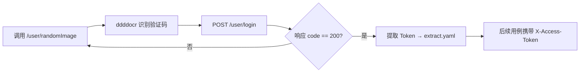

# ERP 接口自动化测试框架

基于 Python + pytest + requests + Allure 实现的接口自动化测试框架，用于对管伊佳 ERP v3.6 系统进行接口级功能验证、业务链路回归和数据校验。

---

## 一、项目简介

本项目是一个面向 Web 系统的接口自动化测试框架，主要针对进销存 ERP 系统的后端接口进行自动化测试。

**项目背景：** 在实习 / 项目实践中，手动回归 ERP 系统的采购、销售、库存等核心业务链路效率低、易遗漏。因此搭建了该接口自动化测试框架，用于日常回归测试和冒烟测试。

**主要解决问题：**
- 批量执行接口测试用例，代替手工点击页面验证
- 自动处理登录态（验证码识别 + Token 管理 + 自动续期）
- 实现接口间的数据依赖传递，串联完整业务链路
- 自动生成测试报告并通过钉钉 / 邮件通知结果

**适用场景：**
- 接口回归测试
- 接口冒烟测试
- 进销存核心链路稳定性验证
- 持续集成中的自动化测试环节（可接入 Jenkins）

---

## 二、技术栈

| 技术 / 工具           | 作用                                       |
| --------------------- | ------------------------------------------ |
| Python 3.12           | 编程语言                                   |
| pytest 9.0            | 测试框架                                   |
| requests              | HTTP 请求库                                |
| PyYAML                | YAML 数据驱动（测试用例 + 参数提取）        |
| Allure                | 测试报告生成                               |
| pytest-ordering       | 测试用例执行顺序控制                        |
| ddddocr + Pillow      | 验证码自动识别（登录场景）                  |
| jsonpath              | JSON 响应数据提取                          |
| logging (RotatingFileHandler) | 日志记录，自动滚动备份                  |
| PyMySQL               | MySQL 数据库连接与断言                     |
| 钉钉机器人             | 测试结果即时通知                           |
| smtplib               | 邮件发送测试报告                           |

---

## 三、项目功能

### 1. 接口请求统一封装
`common/sendrequest.py` 封装了对 GET / POST / PUT / DELETE 等 HTTP 方法的请求，统一处理超时、SSL 证书验证，并将请求日志和参数写入 Allure 报告。

### 2. YAML 数据驱动测试
测试用例以 YAML 文件编写，每个用例包含 `baseInfo`（接口地址、方法、请求头）和 `testCase`（具体请求参数、预期结果）。`common/readyaml.py` 负责读取和解析 YAML。

### 3. 动态参数处理
`common/debugtalk.py` 提供 `md5_encryption()`、`timestamp()`、`fixed_timestamp()`、`gen_bar_code()` 等辅助函数，支持在 YAML 中以 `${函数名()}` 语法动态生成参数。

### 4. 登录鉴权与 Token 自动管理
- `testcase/conftest.py` 中的 `system_login` fixture 在 session 级别自动执行登录，通过 ddddocr 识别验证码，提取 Token 并写入 `extract.yaml`
- 当接口返回 `loginOut` 时，`base/apiutil.py` 自动触发重新登录并重试当前请求，最多 5 次

### 5. 多类型断言
`common/assertions.py` 支持：
- **contains** — 响应文本包含指定字段值
- **eq** — 响应字段精确相等
- **ne** — 响应字段不相等
- **rv** — 响应任意值断言
- **db** — 数据库断言（执行 SQL 查询验证数据是否落库）
- **db_eq** — 数据库相等断言（执行 SQL 查询并将结果与期望值比较）

### 6. 接口数据依赖（提取与传递）
`extract.yaml` 作为全局变量存储文件。`base/apiutil.py` 支持使用 JSONPath 或正则表达式从接口响应中提取数据，写入 `extract.yaml`，后续用例通过 `${get_extract_data(key)}` 引用。

### 7. 环境配置管理
`conf/config.ini` 统一管理环境地址、数据库连接、邮件、钉钉等配置。`conf/config.ini.example` 提供了配置模板，便于新环境快速接入。

### 8. 日志记录
`common/recordlog.py` 使用 RotatingFileHandler 实现日志自动滚动备份（单个文件 5MB，保留 7 个备份），自动清理 30 天前的过期日志。

### 9. Allure 测试报告
测试报告包含：接口名称、请求地址、请求方法、请求头、请求参数、响应信息、断言结果。`run.py` 自动生成 Allure 报告并启动本地服务。

### 10. 测试结果通知
- **钉钉机器人**：`common/dingRobot.py` 通过加签方式发送测试摘要到钉钉群
- **邮件通知**：`common/semail.py` 发送测试结果邮件（支持附件）

### 11. 数据库校验
支持 MySQL 数据库的数据查询与断言，可用于接口测试前后验证数据落库情况。

---

## 四、项目目录结构

```text
column-erp-testing/
├── base/                          # 核心测试框架层
│   ├── apiutil.py                 #   接口请求处理核心（参数替换、提取、断言、自动重登）
│   ├── apiutil_business.py        #   业务场景专用请求处理器
│   ├── generateId.py              #   Allure 模块/用例编号生成器
│   └── removefile.py              #   测试产物清理工具
├── common/                        # 公共组件层
│   ├── assertions.py              #   断言引擎（contains/eq/ne/rv/db）
│   ├── connection.py              #   数据库连接（MySQL）
│   ├── debugtalk.py               #   动态数据生成（加密、时间戳、验证码、条码）
│   ├── dingRobot.py               #   钉钉机器人通知
│   ├── readyaml.py                #   YAML 读写（测试数据 + 提取变量）
│   ├── recordlog.py               #   日志记录（滚动备份、自动清理）
│   ├── semail.py                  #   邮件通知
│   ├── send_notification.py       #   通知整合工具
│   └── sendrequest.py             #   HTTP 请求发送（含自动重新登录）
├── conf/                          # 配置层
│   ├── config.ini                 #   实际运行配置（不提交到 Git）
│   ├── config.ini.example         #   配置模板
│   ├── environment.xml            #   Allure 环境信息
│   ├── operationConfig.py         #   INI 配置文件解析器
│   └── setting.py                 #   全局路径与常量定义
├── conftest.py                    # 根级 pytest 钩子（清理产物、钉钉/邮件通知）
├── testcase/                      # 测试用例层
│   ├── conftest.py                #   全局 fixture（自动登录、数据清理）
│   ├── ERP/
│   │   ├── loginName.yaml         #   登录接口用例
│   │   ├── Single_Interface/      #   单接口测试
│   │   │   ├── 商品管理/           #     商品 CRUD（create → read → update）
│   │   │   ├── 仓库管理/           #     仓库 CRUD（create → read → update → delete）
│   │   │   ├── 采购管理/           #     采购入库单（新增 → 查询 → 审核 → 付款）
│   │   │   └── 销售管理/           #     销售出库单（新增 → 查询 → 审核 → 收款）
│   │   ├── Business_Scenario/     #   业务场景测试
│   │   │   ├── PurchaseScenario.yml   #   采购全链路（创建商品 → 采购入库 → 审核 → 付款）
│   │   │   ├── SalesScenario.yml      #   销售全链路（创建商品 → 销售出库 → 审核 → 收款）
│   │   │   └── test_business_scenario.py
│   │   └── Exception/              #   异常场景测试
│   │       ├── sales_exception.yml    #   销售异常（库存溢出/重复单号/重复审核）
│   │       ├── payment_exception.yml  #   收付款异常（超额收款）
│   │       └── test_exception.py      #   鉴权异常(Python原生)+销售/收付款(YAML驱动)
├── logs/                          # 日志输出目录（自动生成）
├── report/                        # 测试报告目录（自动生成）
│   ├── temp/                      #   Allure 临时结果
│   └── allureReport/              #   Allure 静态报告
├── extract.yaml                   # 接口关联变量存储（自动生成，不提交）
├── run.py                         # 测试执行入口
├── pytest.ini                     # pytest 配置（过滤警告、文件匹配规则）
└── requirements.txt               # Python 依赖清单
```

---

## 五、框架设计思路

### 配置层（conf/）
所有可变配置集中在 `config.ini`：被测环境地址、数据库连接参数、邮件/钉钉凭据、报告类型等。通过 `OperationConfig` 统一读取，实现环境与代码隔离。

### 数据层（YAML + extract.yaml）
- 测试数据以 YAML 文件管理，与 Python 代码分离
- `extract.yaml` 作为全局变量池，存储接口间传递的数据（Token、单据 ID、条码等），支持顺序 / 随机读取

### 请求层（common/sendrequest.py + base/apiutil.py）
`SendRequest` 封装了 `session.request()`，统一处理超时、SSL 验证和 Cookie 存储。`RequestBase.specification_yaml()` 是核心调度方法：解析 YAML → 替换动态参数 → 发送请求 → 提取响应数据 → 执行断言 → 记录 Allure。

### 用例层（testcase/）
测试用例分为两类：
- **单接口测试**：针对单个接口的 CRUD 验证，覆盖正常流程
- **业务场景测试**：串联多个接口，模拟真实业务操作（如采购入库 → 查询 → 审核 → 付款）

### 断言层（common/assertions.py）
支持六种断言模式，通过 YAML 中 `validation` 字段声明。断言失败时会累积错误 flag，最终统一判定用例结果，并将预期/实际值写入 Allure 报告。

### 报告层（Allure）
每个接口的执行过程（名称、地址、参数、响应、断言）都以 Allure attachment 形式记录。`run.py` 自动生成 HTML 报告并启动本地服务。

### 工具层（common/）
包含日志、YAML 读写、数据库连接、加密、通知等公共能力，各模块通过 `from common.xxx import Xxx` 引用。

---

## 六、核心流程

```mermaid
flowchart TD
    A[读取 conf/config.ini 配置] --> B[Session 级 fixture: 自动登录]
    B --> C[OCR 识别验证码 → 获取 Token]
    C --> D{提取 Token 写入 extract.yaml}
    D --> E[加载 YAML 测试用例]
    E --> F[替换动态参数 ${func()} / ${get_extract_data()}]
    F --> G[发送 HTTP 请求]
    G --> H[提取响应数据到 extract.yaml]
    H --> I[执行多重断言]
    I --> J{断言是否全部通过}
    J -- 是 --> K[记录成功日志]
    J -- 否 --> L[记录失败日志 + Allure 附件]
    K --> M[Allure 生成测试报告]
    L --> M
    M --> N[钉钉/邮件通知测试结果]
```

### 登录流程（自动处理）



### Token 过期自动处理

```mermaid
flowchart LR
    A[发送接口请求] --> B{响应 == loginOut?}
    B -- 否 --> C[正常解析]
    B -- 是 --> D[触发 _relogin()]
    D --> E[重新获取 Token]
    E --> F[更新 extract.yaml]
    F --> G[重试当前请求]
```

---

## 七、快速开始

### 1. 克隆项目

```bash
git clone <仓库地址>
cd column-erp-testing
```

### 2. 安装依赖

```bash
pip install -r requirements.txt
```

> 注意：`requirements.txt` 中包含了 ddddocr（验证码识别）和 onnxruntime，首次运行会自动下载模型文件。

### 3. 修改配置

```bash
cp conf/config.ini.example conf/config.ini
```

编辑 `conf/config.ini`，填写实际的环境地址和数据库连接信息：

```ini
[api_envi]
host = http://你的服务器地址/jshERP-boot

[MYSQL]
host = 你的MySQL地址
port = 3306
username = 数据库用户名
password = 数据库密码
database = jsh_erp
```

### 4. 执行测试

```bash
# 方式一：使用 run.py（推荐）
python run.py

# 方式二：直接使用 pytest
pytest -s -v --alluredir=./report/temp ./testcase/ERP/ --clean-alluredir
```

### 5. 查看报告

Allure 报告生成在 `./report/allureReport/` 目录，**不要直接双击** `index.html` 打开（浏览器安全策略会阻止 JS 加载），推荐使用以下方式查看：

```bash
# 方式一：使用 allure 命令（推荐）
allure open ./report/allureReport

# 方式二：使用 Python 内置 HTTP 服务器
python -m http.server 8080 -d ./report/allureReport
# 然后浏览器访问 http://localhost:8080
```

如使用 `python run.py` 执行，报告会自动生成并在本地浏览器中打开。

---

## 八、一键回归使用说明

### 1. 用例分组（pytest marker）

本项目基于 pytest marker 对测试用例进行逻辑分组，每个 marker 对应一类回归场景：

| Marker     | 含义         | 覆盖范围                                                                 |
| ---------- | ------------ | ------------------------------------------------------------------------ |
| `smoke`    | 冒烟测试     | 核心业务链路（采购入库链路 + 销售出库链路），快速验证系统是否可用         |
| `single`   | 单接口测试   | 商品管理、仓库管理、采购管理、销售管理各模块的单接口 CRUD 用例            |
| `business` | 业务链路测试 | 采购全链路（创建商品 → 入库 → 审核 → 付款）和销售全链路（创建商品 → 出库 → 审核 → 收款） |
| `exception`| 异常场景测试 | Token为空/错误、库存溢出、重复单号、重复审核、超额收款等异常场景校验       |

### 2. 一键执行入口

`run.py` 封装了 marker 过滤、报告生成、CI 适配等逻辑，推荐作为日常回归入口：

```bash
# 冒烟测试 — 快速验证核心链路
python run.py --suite smoke

# 单接口回归 — 覆盖各模块单接口 CRUD
python run.py --suite single

# 业务链路回归 — 覆盖采购/销售全链路
python run.py --suite business

# 异常场景测试 — 覆盖鉴权/库存/重复提交/超额收款异常场景
python run.py --suite exception

# 全量回归 — 执行所有用例
python run.py --suite all
```

### 3. 直接使用 pytest

也可跳过 `run.py`，直接使用 pytest 原生命令，灵活组合 marker：

```bash
# 冒烟测试
pytest -m smoke

# 单接口测试
pytest -m single

# 业务链路测试
pytest -m business

# 异常场景测试
pytest -m exception

# 多 marker 组合（例如仅执行既是 smoke 又是 business 的用例）
pytest -m "smoke and business"
```

> 推荐优先使用 `python run.py --suite <suite>`，因为它会自动处理 Allure 报告生成、环境信息注入、CI 环境检测等步骤。

### 4. CI 集成说明

`run.py` 自动检测以下环境变量，检测到任一为 `true` 时跳过浏览器打开步骤，适用于 Jenkins / GitHub Actions 等 CI 环境：

- `CI=true`
- `GITHUB_ACTIONS=true`
- `JENKINS_CI=true`

可在 CI 流水线中直接配置 `python run.py --suite smoke` 作为快速验证环节，或 `python run.py --suite all` 作为全量回归环节。

---

## 九、测试报告展示

本项目使用 Allure 生成测试报告，包含以下内容：

- **概览页**：测试通过率、执行时长、环境信息
- **功能模块分类**：按 `@allure.feature` 划分（商品管理、仓库管理、采购管理、销售管理、业务场景）
- **用例详情**：每个用例记录接口名称、地址、方法、请求头、请求参数、响应信息、断言结果
- **失败定位**：失败的断言会显示预期值与实际值的对比

> 测试报告截图可在后续补充。

> 如需邮件发送报告，直接运行 `pytest` 即可，框架会自动调用 `BuildEmail` 发送结果摘要到配置的邮箱。

---

## 十、项目亮点

### 1. 分层清晰的框架设计
框架分为配置层、数据层、请求层、用例层、断言层、报告层、工具层，各层职责单一、通过 import 组合，便于维护和扩展。

### 2. 自动化登录 Token 管理
集成 ddddocr 实现验证码自动识别，测试 session 自动完成登录。当 Token 过期时自动检测（`loginOut` 响应）并重新获取，保证长时测试稳定性。

### 3. YAML 驱动的数据与代码分离
测试数据与 Python 代码完全分离，新增接口用例只需编写 YAML 文件，无需修改框架代码。参数支持 `${函数名()}` 动态生成，灵活性强。

### 4. 多类型断言体系
支持字符串包含、精确相等、不相等、任意值、数据库 SQL 五种断言模式，测试人员可以根据场景灵活选择或组合使用。

### 5. 接口数据依赖自动传递
通过 `extract.yaml` 实现接口间的数据关联：一个接口的响应字段（如单据 ID、条码）可自动提取并传递给后续接口使用，完成业务链路的串联。

### 6. MySQL 数据库断言
框架内置 MySQL 数据库连接封装，测试用例中可通过 `db:` 断言关键字直接编写 SQL 语句验证数据落库，确保接口功能与数据一致性同时覆盖。

### 7. 多渠道测试结果通知
测试执行完成后自动发送钉钉机器人消息和邮件，包含测试总数、通过数、失败数、通过率等摘要信息，方便团队及时了解测试结果。

### 8. 自动重试与异常处理
登录接口支持 5 次重试（验证码识别失败时自动重试），Token 过期后自动重新登录并重试请求，提升测试稳定性。

---

## 十一、GitHub Actions 持续集成

本项目已接入 GitHub Actions，实现接口自动化测试的 CI 自动执行。

### 1. 工作流说明

工作流文件位于 `.github/workflows/api-test.yml`，名称为 **ERP API Automation Test**。

当前支持以下触发方式：

- **手动触发（workflow_dispatch）**：可在 GitHub Actions 页面选择测试套件后，对真实 ERP 服务执行接口自动化测试
- **Push 触发**：当推送代码到 `master` 或 `main` 分支时，仅执行 Python 语法检查和 pytest 用例收集校验，**不发送真实接口请求**

### 2. 支持的测试套件

| 套件       | 说明             | 对应 pytest marker |
| ---------- | ---------------- | ------------------ |
| `smoke`    | 冒烟测试（默认） | `-m smoke`         |
| `single`   | 单接口测试       | `-m single`        |
| `business` | 业务链路测试     | `-m business`      |
| `exception`| 异常场景测试     | `-m exception`     |
| `all`      | 全量测试         | 不限制 marker      |

### 3. 配置 GitHub Secrets

在 GitHub 仓库的 **Settings → Secrets and variables → Actions** 中配置以下 Secrets：

| Secret 名称          | 说明                     | 是否必填 |
| -------------------- | ------------------------ | -------- |
| `ERP_HOST`           | ERP 服务地址（含前缀）   | 是       |
| `MYSQL_HOST`         | MySQL 地址               | 是       |
| `MYSQL_PORT`         | MySQL 端口               | 是       |
| `MYSQL_USERNAME`     | MySQL 用户名             | 是       |
| `MYSQL_PASSWORD`     | MySQL 密码               | 是       |
| `MYSQL_DATABASE`     | MySQL 数据库名           | 是       |
| `DINGTALK_WEBHOOK`   | 钉钉机器人 Webhook 地址  | 否       |
| `DINGTALK_SECRET`    | 钉钉机器人加签密钥       | 否       |
| `EMAIL_HOST`         | 邮件 SMTP 地址           | 否       |
| `EMAIL_PORT`         | 邮件 SMTP 端口           | 否       |
| `EMAIL_USER`         | 邮箱账号                 | 否       |
| `EMAIL_PASSWD`       | 邮箱授权码               | 否       |
| `EMAIL_ADDRESSEE`    | 收件人邮箱地址           | 否       |

> 钉钉和邮件相关 Secrets 可为空，留空时不发送通知（`conftest.py` 在 CI 环境中自动跳过通知发送）。

### 4. 手动触发步骤

1. 打开 GitHub 仓库页面
2. 点击顶部 **Actions** 选项卡
3. 在左侧 Workflows 列表中选择 **ERP API Automation Test**
4. 点击 **Run workflow** 按钮
5. 在下拉菜单中选择要执行的测试套件（默认 `smoke`）
6. 点击 **Run workflow** 确认执行

### 5. 查看测试结果

**手动触发（真实接口测试）** 执行完成后，在 Workflow 运行结果页面可以：

1. **查看实时日志** — 点击运行中的 workflow，查看每个步骤的控制台输出
2. **下载测试产物（Artifacts）** — 在运行结果页面底部，找到 **Artifacts** 区域，下载 `erp-api-test-<suite>-<run_id>` 压缩包，内含：
   - `report/results.xml` — pytest JUnit 格式结果
   - `report/temp/` — Allure 原始结果（json 文件），可在本地用 `allure generate` 生成报告
   - `report/allureReport/` — Allure HTML 静态报告（直接打开 `index.html`）
   - `logs/` — 运行时日志文件

**Push 触发（代码检查）** 执行完成后，可在运行日志中查看 `py_compile` 语法检查结果和 `pytest --collect-only` 的用例收集统计。

### 6. 安全注意事项

> **⚠️ 真实接口测试请使用 workflow_dispatch 手动触发，不要在 push 时自动执行。** 当前测试用例包含创建商品、采购入库→审核→付款、销售出库→审核→收款等有副作用的操作。push 触发仅做代码语法检查和用例收集校验，不发送真实接口请求，避免污染测试环境。

- **不建议在生产环境执行新增、修改、删除、审核、付款、收款等有副作用的自动化用例**
- 如果需要在生产环境执行，建议仅运行只读接口或健康检查类 `smoke` 用例
- 云服务器安全组需要允许 GitHub Actions 的公网 IP 访问 API 服务（参考 [GitHub Actions IP 范围](https://docs.github.com/en/authentication/keeping-your-account-and-data-secure/about-githubs-ip-addresses)）
- 如果测试用例包含数据库断言，MySQL 也必须能被 GitHub Actions 访问
- 如果不希望数据库暴露公网，建议改用 **self-hosted runner**（在云服务器内安装 GitHub Actions Runner）或通过 Jenkins 在云服务器内网执行

### 7. Workflow 徽章

[](https://github.com/C0LUMN7/column-erp-testing/actions/workflows/api-test.yml)

---

## 十二、异常场景测试

### 1. 概述

在正常业务流程测试的基础上，新增了 `exception` 异常场景测试套件，用于验证系统在异常输入或异常操作下的容错能力和数据一致性。

### 2. 已覆盖的异常场景

| 编号 | 场景               | 所属模块 | 实现方式                 |
| ---- | ------------------ | -------- | ------------------------ |
| 1    | Token 为空访问核心接口 | 鉴权     | Python 原生(`test_exception.py`) |
| 2    | Token 错误访问核心接口 | 鉴权     | Python 原生(`test_exception.py`) |
| 3    | 销售出库数量大于库存   | 销售     | YAML 驱动(`sales_exception.yml`) |
| 4    | 重复提交相同销售单号   | 销售     | YAML 驱动(`sales_exception.yml`) |
| 5    | 重复审核同一张销售出库单 | 销售     | YAML 驱动(`sales_exception.yml`) |
| 6    | 超额收款边界场景（系统允许，校验数据一致性） | 收付款 | YAML 驱动(`payment_exception.yml`) |

### 3. 异常场景校验重点

- **接口校验**：接口是否正确拒绝异常请求（HTTP 状态码 ≠ 200 或返回业务错误码）
- **数据库校验**：是否产生脏数据（无效单据、错误库存扣减、异常收付款记录）
- **库存校验**：销售出库数量大于库存时，库存不应变成负数；重复提交/审核时，库存不应被重复扣减
- **幂等性校验**：重复审核同一张单据时，库存扣减和单据状态变化只应发生一次
- **超额收款边界场景**：当前 ERP 系统允许超额收款，该用例按系统实际返回成功进行断言，重点校验收款单金额、销售单欠款状态和收款明细关联等数据一致性

### 4. 执行方式

异常场景测试仅建议手动执行，不会在 `push` 时自动运行：

```bash
# 方式一：使用 run.py（推荐，自动生成 Allure 报告）
python run.py --suite exception

# 方式二：直接使用 pytest
pytest -m exception
```

在 GitHub Actions 中可通过 `workflow_dispatch` 手动选择 `exception` 套件执行。

### 5. 测试数据说明

异常场景使用 `EX_` 前缀的测试数据，便于识别和清理：

- `EX_MATERIAL_SC{3,4,5,6}_${timestamp()}` — 异常测试商品
- `EX_SO_SC{3,4,5,6}_${timestamp()}` — 异常测试销售出库单号
- `EX_SK_SC6_${timestamp()}` — 异常测试收款单号

`testcase/conftest.py` 中的 `datadb_init` fixture 已包含 `EX_` 前缀数据的后置清理。

### 6. 新增断言类型：db_eq

在原有 `db` 断言（仅判断 SQL 查询结果非空）的基础上，新增了 `db_eq` 断言，支持将 SQL 查询结果与期望值进行精确比较：

```yaml
validation:
  - db_eq:
      sql: "select count(*) from jsh_depot_head where number='EX_SO_001'"
      expect: 0
```

`db_eq` 向后兼容，不会影响现有用例。断言失败时，SQL、期望值和实际值会写入日志和 Allure 报告。

### 7. 注意事项

- 异常用例之间相互独立，不依赖其他异常用例的执行结果
- 每个异常场景尽量自己准备测试数据，避免数据耦合
- 鉴权异常（Token 为空/错误）使用 Python 原生 `requests` 实现，绕过框架自动重登机制，避免 `loginOut` 响应触发重登干扰测试结果
- 销售/收付款异常使用 YAML 驱动 + `specification_yaml`，由框架自动处理 Token
- 如果系统允许重复单号，请记录实际行为并在 README 中注明为"待确认业务规则/潜在风险"
- **超额收款边界场景说明**：当前 ERP 系统允许超额收款，该用例按系统实际返回成功进行断言，重点校验收款单金额、销售单欠款状态和收款明细关联等数据一致性
- 所有异常场景结合数据库断言，验证异常请求不会产生脏数据

---

## 十三、后续优化方向

1. ~~**接入持续集成** — 配置 Jenkins / GitHub Actions，实现代码提交后自动触发接口测试并归档报告~~ ✅ **已实现 GitHub Actions CI**（详见第十一章）
2. **增加异常场景测试** — 目前以正常流程为主，后续补充参数缺失、参数非法、鉴权异常、并发请求等异常场景覆盖
3. **测试数据自动准备与清理** — 目前 `datadb_init` fixture 中数据清理代码为占位状态，后续完善数据库层面的前置数据写入和后置清理机制
4. **增加 Mock 测试** — 当被测接口依赖第三方系统或环境不稳定时，引入 Mock 机制隔离外部依赖
5. **支持更多请求协议** — 当前只支持 HTTP/HTTPS 接口，后续可扩展 Dubbo、gRPC 等协议的测试能力
6. **失败用例自动重跑** — 增加 pytest-rerunfailures 插件，对偶发失败的用例进行自动重试，减少误报
7. **测试数据参数化文件** — 当前 YAML 中直接写死了部分测试数据，后续可改为从 CSV 或 Excel 文件读取，便于测试人员维护数据
